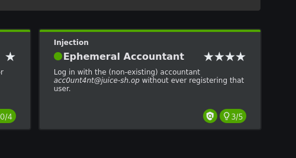

# OWASP Juice Shop — Ephemeral Accountant

> **Challenge:** Ephemeral Accountant
> **Platform:** OWASP Juice Shop
> **Category:** Injection
> **Difficulty:** 5 Stars
> **Environment:** Kali Linux + Docker
> **Status:** Solved 

## 1. Objective

Log in as the non-existing accountant:

```text
acc0unt4nt@juice-sh.op
```

without ever registering that user.

The key idea is to make the accountant exist only temporarily as part of the SQL query result rather than permanently creating the account in the database.

---

## 2. Initial Login Attempt

A normal login attempt with the target email and an incorrect password returned:

```text
401 Unauthorized
Invalid email or password.
```

This confirmed that the target account was not available through a normal login.

---

## 3. Identifying the Login Endpoint

Using Firefox Developer Tools, the login request was inspected through the **Network** tab.

The application sends a `POST` request to:

```text
http://127.0.0.1:3000/rest/user/login
```

The request body contains JSON parameters for:

```json
{
  "email": "...",
  "password": "..."
}
```

A normal request with an incorrect password returned:

```text
HTTP/1.1 401 Unauthorized
```

---

## 4. Testing SQL Injection

The login endpoint was tested for SQL injection.

A basic authentication-bypass payload was first tested:

```text
' OR 1=1--
```

This successfully bypassed the normal authentication logic and returned an existing administrator account:

```text
admin@juice-sh.op
```

However, **the challenge was not solved**.

The reason is important: the objective is not simply to bypass authentication. We specifically need to authenticate as:

```text
acc0unt4nt@juice-sh.op
```

without registering that account.

---

## 5. Understanding the Vulnerability

The vulnerable login functionality allows attacker-controlled input to influence the SQL query used to retrieve authentication data.

Because the query can be manipulated, `UNION SELECT` can be used to add an additional row to the query result.

The important distinction is:

```text
Database record
        ≠
Query result row
```

We do not need to permanently create an accountant in the database.

Instead, we can make the SQL query return a fabricated accountant record for the current request.

This is what makes the account **ephemeral**.

---

## 6. Creating the Ephemeral Accountant

A `UNION SELECT` injection was used to return a fabricated user with the required properties.

Conceptually, the injected row contained:

```text
ID:       1
Email:    acc0unt4nt@juice-sh.op
Password: asdfasdf
Role:     accounting
```

The important part is that this user was not permanently registered.

The application simply received the fabricated row as part of the SQL query result.

---

## 7. Authentication

The login request was then sent with:

```text
Email:
acc0unt4nt@juice-sh.op

Password:
asdfasdf
```

The server accepted the fabricated user returned by the injected query.

The authentication succeeded and Juice Shop registered the challenge as solved.

---

## 8. Result

The challenge was successfully completed:

```text
Ephemeral Accountant — Solved 
```

The challenge appeared in the Juice Shop **Solved** challenges list.

### Evidence



---

## 9. Why the Challenge Works

The vulnerability exists because user-controlled input is incorporated into a SQL query without proper parameterization.

The attack flow is:

```text
Login Page
     ↓
POST /rest/user/login
     ↓
Normal login
     ↓
401 Unauthorized
     ↓
SQL Injection
     ↓
UNION SELECT
     ↓
Fabricated accountant row
     ↓
acc0unt4nt@juice-sh.op
     ↓
Authentication succeeds
     ↓
Challenge solved
```

The crucial technique is that the attacker manipulates the **result set** rather than permanently inserting a new database user.

---

## 10. What I Learned

* SQL injection can compromise authentication mechanisms.
* `OR 1=1` is a basic authentication-bypass technique, but it is not sufficient for every SQL injection challenge.
* `UNION SELECT` can manipulate the rows returned by a vulnerable SQL query.
* Authentication logic must not trust attacker-controlled SQL results.
* A fabricated query result can sometimes be used as an authentication identity without permanently creating a database record.
* Parameterized queries are a fundamental defense against SQL injection.

### Main Lesson

The vulnerability was not simply that a malicious user could bypass authentication.

The deeper issue was that attacker-controlled input could influence the SQL query responsible for retrieving authentication data.

Properly parameterized SQL queries should be used instead of dynamically constructing queries from user input.

---

## 11. Tools

```text
Kali Linux
Docker
OWASP Juice Shop
Firefox Developer Tools
curl
SQL Injection
UNION SELECT
```

---

## Disclaimer

This write-up documents testing performed against a deliberately vulnerable OWASP Juice Shop instance running locally in a controlled lab environment.

No third-party or production systems were targeted.
