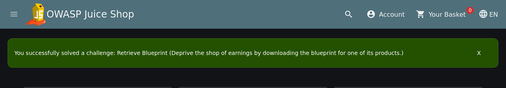

# Retrieve Blueprint

> **Challenge:** Retrieve Blueprint
> **Platform:** OWASP Juice Shop
> **Category:** Sensitive Data Exposure
> **Difficulty:** 5 stars
> **Environment:** Kali Linux + Docker
> **Status:** Solved 

## 1. Objective

The objective was to download the blueprint of the following product:

```text
OWASP Juice Shop Logo (3D-printed)
```

The challenge demonstrates how a sensitive product resource can be exposed through a publicly accessible file.

---

## 2. Identify the Target Product

The challenge points to:

```text
OWASP Juice Shop Logo (3D-printed)
```

The product image is:

```text
3d_keychain.jpg
```

The first step was therefore to inspect the resources associated with this product.

---

## 3. Inspect the Image Metadata

The product image was downloaded/located locally and its metadata was inspected.

On Kali Linux:

```bash
exiftool 3d_keychain.jpg
```

The metadata contained the following relevant value:

```text
OpenSCAD
```

This was the important clue.

OpenSCAD is used for creating 3D models, so the next step was to look for a 3D-model file rather than another image.

The expected file format was:

```text
.stl
```

---

## 4. Find the Blueprint

The relevant blueprint filename is:

```text
JuiceShop.stl
```

The Juice Shop challenge configuration associates this file with the **Retrieve Blueprint** challenge.

To verify whether the resource was publicly accessible, the file was requested directly from the local Juice Shop instance.

Because the Juice Shop instance was running on:

```text
http://127.0.0.1:3000
```

the resource was requested from the application's public product-resource path.

---

## 5. Retrieve the File with curl

The resource can be tested from Kali using:

```bash
curl -I http://127.0.0.1:3000/assets/public/images/products/JuiceShop.stl
```

If the resource is accessible, the server responds with a successful HTTP response instead of an authorization error.

To actually retrieve the file:

```bash
curl -o JuiceShop.stl http://127.0.0.1:3000/assets/public/images/products/JuiceShop.stl
```

Then verify that the file was downloaded:

```bash
ls -lh JuiceShop.stl
```

And inspect the file type:

```bash
file JuiceShop.stl
```

A successful retrieval confirms that the blueprint was accessible as a public resource.

---

## 6. Alternative: Verify the Resource in the Browser

The same resource can be requested directly from Firefox:

```text
http://127.0.0.1:3000/assets/public/images/products/JuiceShop.stl
```

If Juice Shop serves the file, the blueprint is retrieved without requiring authentication.

---

## 7. Why This Works

The vulnerability is related to **Sensitive Data Exposure**.

The blueprint is stored in a publicly accessible resource location instead of being protected by an authorization check.

The attack flow is:

```text
Target Product
      ↓
OWASP Juice Shop Logo (3D-printed)
      ↓
Inspect product image
      ↓
EXIF metadata
      ↓
OpenSCAD
      ↓
Look for STL resource
      ↓
JuiceShop.stl
      ↓
Request public resource
      ↓
Blueprint downloaded
      ↓
Challenge solved 
```

The important security lesson is that a sensitive file should not become accessible merely because an attacker can discover its filename or URL.

---

## 8. Verify the Challenge

After retrieving the blueprint, return to the Juice Shop Score Board and check:

```text
Retrieve Blueprint
```

The challenge should be displayed as:

```text
Solved 
```

### Evidence



---

## 9. Security Impact

In a real application, exposing sensitive design files could reveal:

* Product designs
* CAD/3D-model files
* Engineering information
* Proprietary assets
* Internal resources

Public resource directories should therefore be carefully reviewed to ensure that sensitive files are not exposed unintentionally.

---

## 10. What I learned

* EXIF metadata can provide useful reconnaissance clues.
* File formats can help identify related resources.
* Public static resources should be reviewed for sensitive information.
* A hidden or difficult-to-guess URL is not an access-control mechanism.
* Sensitive resources should be protected with proper server-side authorization.
* `curl` is useful for quickly testing whether a resource is publicly accessible.

### Main Lesson

**Sensitive data should be protected by authorization, not by obscurity.**

---

## 11. Tools

```text
Kali Linux
Docker
OWASP Juice Shop
Firefox
curl
ExifTool
```

## 12. Commands Used

```bash
# Inspect image metadata
exiftool 3d_keychain.jpg

# Check whether the blueprint is publicly accessible
curl -I http://127.0.0.1:3000/assets/public/images/products/JuiceShop.stl

# Download the blueprint
curl -o JuiceShop.stl http://127.0.0.1:3000/assets/public/images/products/JuiceShop.stl

# Verify the downloaded file
ls -lh JuiceShop.stl

# Identify the file type
file JuiceShop.stl
```

## Disclaimer

This write-up documents testing performed against a deliberately vulnerable OWASP Juice Shop instance running locally in a controlled lab environment.

No third-party or production systems were targeted.
